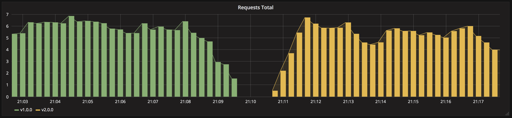
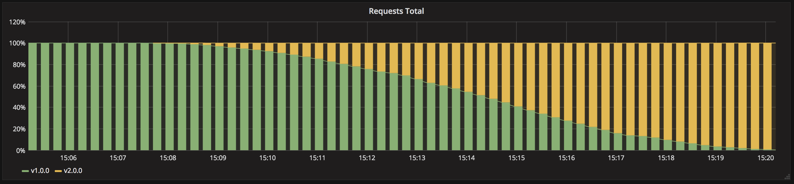
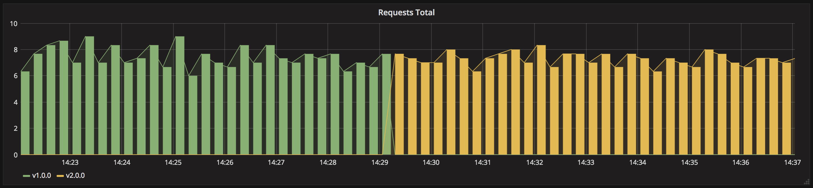
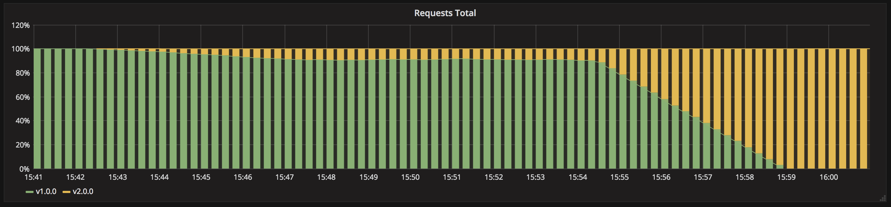
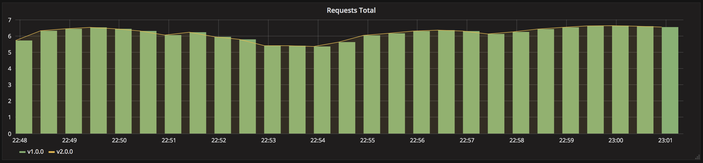

Kubernetes deployment strategies
================================

> In Kubernetes there is few different way to release an application, you have
to carefully choose the right strategy to make your infrastructure resilient.

- [recreate](recreate/): terminate the old version and release the new one
- [ramped](ramped/): release a new version on a rolling update fashion, one
  after the other
- [blue/green](blue-green/): release a new version alongside the old version
  then switch traffic
- [canary](canary/): release a new version to a subset of users, then proceed
  to a full rollout
- [a/b testing](ab-testing/): release a new version to a subset of users in a
  precise way (HTTP headers, cookie, weight, etc.). This doesn’t come out of the
  box with Kubernetes, it imply extra work to setup a smarter
  loadbalancing system (Istio, Linkerd, Traeffik, custom nginx/haproxy, etc).
- [shadow](shadow/): release a new version alongside the old version. Incoming
  traffic is mirrored to the new version and doesn't impact the
  response.


Before experimenting, checkout the following resources:
- [CNCF prensentation](https://www.youtube.com/watch?v=1oPhfKye5Pg)
- [CNCF prensentation slides](https://www.slideshare.net/EtienneTremel/kubernetes-deployment-strategies-cncf-webinar)
- [Kubernetes deployment strategies](https://container-solutions.com/kubernetes-deployment-strategies/)
- [Six Strategies for Application Deployment](https://thenewstack.io/deployment-strategies/).
- [Canary deployment using Istio and Helm](https://github.com/etiennetremel/istio-cross-namespace-canary-release-demo)
- [Automated rollback of Helm releases based on logs or metrics](https://container-solutions.com/automated-rollback-helm-releases-based-logs-metrics/)

## Getting started

These examples were created and tested on [Minikube](http://github.com/kubernetes/minikube)
running with Kubernetes v1.10.0.

```
$ minikube start --kubernetes-version v1.10.0 --memory 8192 --cpus 2
```


## Visualizing using Prometheus and Grafana

The following steps describe how to setup Prometheus and Grafana to visualize
the progress and performance of a deployment.

### Install Helm

To install Helm, follow the instructions provided on their
[website](https://github.com/kubernetes/helm/releases).

```
$ helm init
```

### Install Prometheus

```
$ helm install \
    --namespace=monitoring \
    --name=prometheus \
    --version=7.0.0 \
    stable/prometheus
```

### Install Grafana

```
$ helm install \
    --namespace=monitoring \
    --name=grafana \
    --version=1.12.0 \
    --set=adminUser=admin \
    --set=adminPassword=admin \
    --set=service.type=NodePort \
    stable/grafana
```

### Setup Grafana

Now that Prometheus and Grafana are up and running, you can access Grafana:

```
$ minikube service grafana
```

To login, username: `admin`, password: `admin`.

Then you need to connect Grafana to Prometheus, to do so, add a DataSource:

```
Name: prometheus
Type: Prometheus
Url: http://prometheus-server
Access: Server
```

Create a dashboard with a Graph. Use the following query:

```
sum(rate(http_requests_total{app="my-app"}[5m])) by (version)
```

To have a better overview of the version, add `{{version}}` in the legend field.

#### Example graph

Recreate:



Ramped:



Blue/Green:



Canary:



A/B testing:


Shadow:


