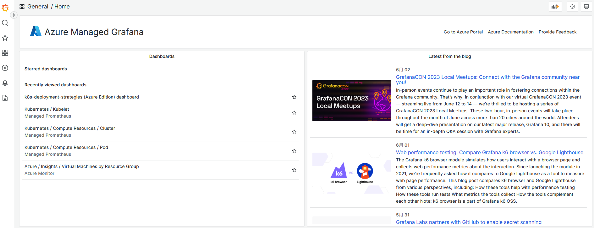
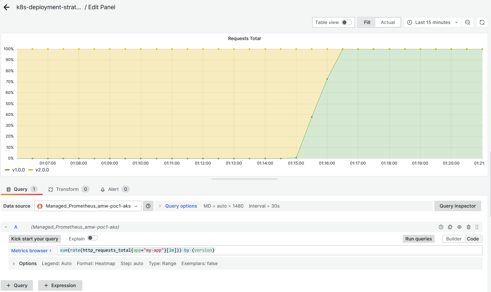
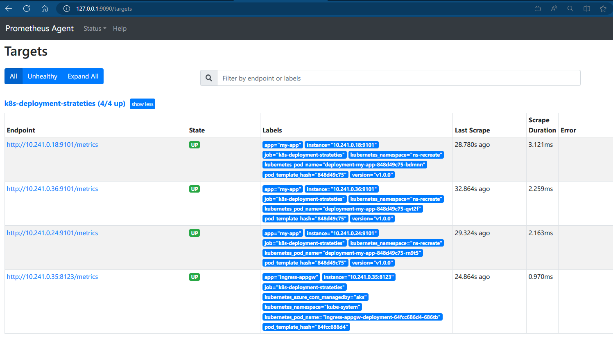

# Kubernetes deployment strategies (Azure Edition)

> In Kubernetes there are a few different ways to release an application, you have
to carefully choose the right strategy to make Microsoft Azure infrastructure resilient.

- [ ] [recreate](recreate/): terminate the old version and release the new one
  - [x] Application Gateway Ingress Controller
  - [ ] Azure Load Balancer + Istio service mesh
- [ ] [ramped](ramped/): release a new version on a rolling update fashion, one
  after the other
  - [x] Application Gateway Ingress Controller
  - [ ] Azure Load Balancer + Istio service mesh
- [ ] [blue/green](blue-green/): release a new version alongside the old version
  then switch traffic
  - [x] Application Gateway Ingress Controller
  - [ ] Azure Load Balancer + Istio service mesh
- [x] [canary](canary/): release a new version to a subset of users, then proceed
  to a full rollout
  - [x] Application Gateway Ingress Controller: Due to the lack of support for traffic weight functionality, we use manually modified replicas count to achieve the same effect.
  - [x] Azure Load Balancer + Istio service mesh
- [x] [a/b testing](ab-testing/): release a new version to a subset of users in a precise way (HTTP headers, cookie, weight, etc.). This doesn’t come out of the box with Kubernetes, it imply extra work to setup a smarter loadbalancing system (Istio, Linkerd, Traeffik, custom nginx/haproxy, etc).
  - [x] Azure Load Balancer + Istio service mesh
- [x] [shadow](shadow/): release a new version alongside the old version. Incoming
  traffic is mirrored to the new version and doesn't impact the
  response.
  - [x] Azure Load Balancer + Istio service mesh


## Deployment strategy Decision Diagram


Before experimenting, checkout the following resources:

- [CNCF presentation](https://www.youtube.com/watch?v=1oPhfKye5Pg)
- [CNCF presentation slides](https://www.slideshare.net/EtienneTremel/kubernetes-deployment-strategies-cncf-webinar)
- [Kubernetes deployment strategies](https://container-solutions.com/kubernetes-deployment-strategies/)
- [Six Strategies for Application Deployment](https://thenewstack.io/deployment-strategies/).
- [Canary deployment using Istio and Helm](https://github.com/etiennetremel/istio-cross-namespace-canary-release-demo)
- [Automated rollback of Helm releases based on logs or metrics](https://container-solutions.com/automated-rollback-helm-releases-based-logs-metrics/)

## Azure Kubernetes Service (AKS) Deployment Strategy Support Matrix

|   Strategy  |      Use AGIC     | Use Istio Service Mesh? |                               Note                               |
|:-----------:|:-----------------:|:-----------------------:|:----------------------------------------------------------------:|
| Recreate    |        Yes        |           Yes           | Regardless of whether the Ingress Controller is selected or not. |
| Ramped      |        Yes        |           Yes           | Regardless of whether the Ingress Controller is selected or not. |
| Blue/Green  |        Yes        |           Yes           | Regardless of whether the Ingress Controller is selected or not. |
| Canary      | Yes, but manually |           Yes           | Ingress controller is required to work in conjunction.           |
| A/B Testing |         No        |           Yes           | Ingress controller is required to work in conjunction.           |
| Shadow      |         No        |           Yes           | Ingress controller is required to work in conjunction.           |

## Getting started

### 1. Deploy Azure Kubernetes Service and other resources

These examples were created and tested on

- Azure Kubernetes Service v1.26.3
- [Azure Service Mesh (a.k.a Istio Service Mesh)][2] v1.17
- [Azure Application Gateway Ingress Controller (AGIC)][3] Standard v2
- [Azure Monitor managed service for Prometheus][1]
- [Azure Managed Grafana][4] v9.4.10 (5e7d575327)

```bash
$ cd ./deploy
$ ./deploy-aks.sh
$ kubectl apply -f ama-metrics-prometheus-config.yml
$ kubectl apply -f ama-metrics-settings-configmap.yml
```

### 2. Import existing Grafana dashboard in Azure Managed Grafana



Create a dashboard with a Time series or import the [JSON export](grafana-dashboard.json).

Use the following query:

```yaml
sum(rate(http_requests_total{app="my-app"}[2m])) by (version)
```



Since we installed [Azure Managed Prometheus][1] with cutomized settings, it is using the short scrape
interval of `10s` so the range cannot be lower than that.

To have a better overview of the version, add `{{version}}` in the legend field.

## Test script


### Usage

This is a Python script that makes HTTP requests to a web link specified by the provided `AGIC-PUBLIC-IP` address. The script uses the requests library to send GET requests to the specified URL. It has error handling mechanisms to handle different types of exceptions that might occur during the request.

```bash
# Install colorama for colorized output if not already installed
pip3 install colorama

# Run the script
# Example:
# ./curl.py x.x.x.x
./curl.py $AGIC-PUBLIC-IP

# Run the script with a custom header
# Example:
# ./curl.py x.x.x.x test.aks.aliez.tw
./curl.py $AGIC-PUBLIC-IP $HEADER_HOST
```

The script continues to run indefinitely, making periodic requests to the web link and monitoring for errors.

## Example graph

Recreate:


Ramped:


Blue/Green:


Canary:


A/B testing:


Shadow:


## Troubleshooting

### Troubleshoot collection of Prometheus metrics in Azure Monitor

Based on [Troubleshoot collection of Prometheus metrics in Azure Monitor](https://learn.microsoft.com/en-us/azure/azure-monitor/essentials/prometheus-metrics-troubleshoot)

```bash
kubectl port-forward ama-metrics-* -n kube-system 9090
```




### Minimizing Downtime During Deployments with Azure Application Gateway Ingress Controller

Strong recommendation to read [Minimizing Downtime During Deployments](https://azure.github.io/application-gateway-kubernetes-ingress/how-tos/minimize-downtime-during-deployments/)

1. Regarding the `spec.terminationGracePeriodSeconds` parameter, please refer to [ramped/app-v1.yaml#30][5]
2. Regarding the `spec.containers[0].lifecycle.preStop` parameter, please refer to [ramped/app-v1.yaml#L53-L56][6]
3. Add connection draining annotation to the Ingress read by AGIC to allow for in-flight connections to complete, please refer to [ramped/app-v1.yaml#L65-L66][7]

[1]: https://learn.microsoft.com/en-Us/azure/azure-monitor/essentials/prometheus-metrics-overview
[2]: https://learn.microsoft.com/en-us/azure/aks/istio-about
[3]: https://learn.microsoft.com/en-us/azure/application-gateway/ingress-controller-overview
[4]: https://learn.microsoft.com/en-us/azure/managed-grafana/
[5]: https://github.com/pichuang/k8s-deployment-strategies-azure-edition/blob/master/ramped/app-v1.yaml#L30
[6]: https://github.com/pichuang/k8s-deployment-strategies-azure-edition/blob/master/ramped/app-v1.yaml#L53-L56
[7]: https://github.com/pichuang/k8s-deployment-strategies-azure-edition/blob/master/ramped/app-v1.yaml#L65-L66
