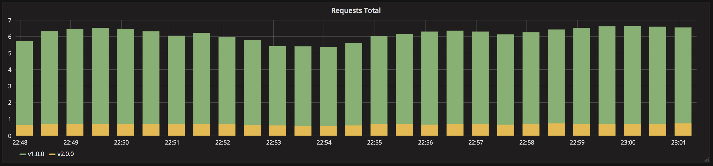

A/B testing using Istio
=======================

> Version B is released to a subset of users under specific condition.



A/B testing deployments consists of routing a subset of users to a new
functionality under specific conditions. It is usually a technique for making
business decisions based on statistics rather than a deployment strategy.
However, it is related and can be implemented by adding extra functionality to a
canary deployment so we will briefly discuss it here.

This technique is widely used to test conversion of a given feature and only
roll-out the version that converts the most.

Here is a list of conditions that can be used to distribute traffic amongst the
versions:

- Weight
- Cookie value
- Query parameters
- Geolocalisation
- Technology support: browser version, screen size, operating system, etc.
- Language

## Steps to follow

1. version 1 is serving HTTP traffic using Istio
1. deploy version 2
1. wait until all instances are ready
1. update Istio VirtualService with 90% traffic targetting version 1 and 10%
   traffic targetting version 2

## In practice

Before starting, it is recommended to know the basic concept of the
[Istio routing API](https://istio.io/blog/2018/v1alpha3-routing/).

### Deploy Istio

In this example, Istio 1.0.0 is used. To install Istio, follow the
[instructions](https://istio.io/docs/setup/kubernetes/helm-install/) from the
Istio website.

Automatic sidecar injection should be enabled by default. Then annotate the
default namespace to enable it.

```
$ kubectl label namespace default istio-injection=enabled
```

### Deploy both applications

Back to the a/b testing directory from this repo, deploy both applications using
the istioctl command to inject the Istio sidecar container which is used to
proxy requests:

```
$ kubectl apply -f app-v1.yaml -f app-v2.yaml
```

Expose both services via the Istio Gateway and create a VirtualService to match
requests to the my-app-v1 service:

```
$ kubectl apply -f ./gateway.yaml -f ./virtualservice.yaml
```

At this point, if you make a request against the Istio ingress gateway with the
given host `my-app.local`, you should only see version 1 responding:

```
$ curl $(minikube service istio-ingressgateway -n istio-system --url | head -n1) -H 'Host: my-app.local'
Host: my-app-v1-6d577d97b4-lxn22, Version: v1.0.0
```

### Shift traffic based on weight

Apply the Istio VirtualService rule based on weight:

```
$ kubectl apply -f ./virtualservice-weight.yaml
```

You can now test if the traffic is correctly splitted amongst both versions:

```
$ service=$(minikube service istio-ingressgateway -n istio-system --url | head -n1)
$ while sleep 0.1; do curl "$service" -H 'Host: my-app.local'; done
```

You should approximately see 1 request on 10 ending up in the version 2.

In the `./virtualservice-weight.yaml` file, you can edit the weight of each
destination and apply the updated rule to Minikube:

```
$ kubectl apply -f ./virtualservice-weight.yaml
```

### Shift traffic based on headers

Apply the Istio VirtualService rule based on headers:

```
$ kubectl apply -f ./virtualservice-match.yaml
```

You can now test if the traffic is hitting the correct set of instances:

```
$ service=$(minikube service istio-ingressgateway -n istio-system --url | head -n1)
$ curl $service -H 'Host: my-app.local' -H 'X-API-Version: v1.0.0'
Host: my-app-v1-6d577d97b4-s4h6k, Version: v1.0.0

$ curl $service -H 'Host: my-app.local' -H 'X-API-Version: v2.0.0'
Host: my-app-v2-65f9fdbb88-jtctt, Version: v2.0.0
```

### Cleanup

```
$ kubectl delete gateway/my-app virtualservice/my-app
$ kubectl delete -f ./app-v1.yaml -f ./app-v2.yaml
$ kubectl delete -f <PATH-TO-ISTIO>/install/kubernetes/istio-demo.yaml
```
