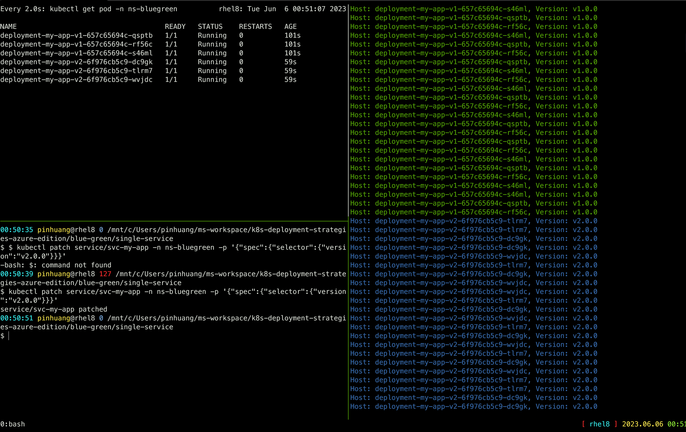

# Blue/green deployment to release a single service

> In this example, we release a new version of a single service using the
blue/green deployment strategy.

## Steps to follow

1. version 1 is serving traffic
2. deploy version 2
3. wait until version 2 is ready
4. switch incoming traffic from version 1 to version 2
5. shutdown version 1

## In practice

```bash
# Deploy the first application
$ kubectl apply -f app-v1.yaml
namespace/ns-bluegreen created
deployment.apps/deployment-my-app-v1 created
ingress.networking.k8s.io/ingress-bluegreen created
service/svc-my-app created

# Test if the deployment was successful
$ ./curl.py apgw.aks.aliez.tw
Host: deployment-my-app-v1-657c65694c-jg4hn, Version: v1.0.0
Host: deployment-my-app-v1-657c65694c-s77mq, Version: v1.0.0
Host: deployment-my-app-v1-657c65694c-62w74, Version: v1.0.0
Host: deployment-my-app-v1-657c65694c-s77mq, Version: v1.0.0
Host: deployment-my-app-v1-657c65694c-62w74, Version: v1.0.0
Host: deployment-my-app-v1-657c65694c-jg4hn, Version: v1.0.0
...omit...

# To see the deployment in action, open a new terminal and run the following
command:
$ watch kubectl get pod -n ns-bluegreen
NAME                                    READY   STATUS    RESTARTS   AGE
deployment-my-app-v1-657c65694c-62w74   1/1     Running   0          2m27s
deployment-my-app-v1-657c65694c-jg4hn   1/1     Running   0          2m27s
deployment-my-app-v1-657c65694c-s77mq   1/1     Running   0          2m27s

# Then deploy version 2 of the application
$ kubectl apply -f app-v2.yaml
deployment.apps/deployment-my-app-v2 created

# Wait for all the version 2 pods to be running
$ kubectl rollout status deployment/deployment-my-app-v2 -n ns-bluegreen -w
deployment "deployment-my-app-v2" successfully rolled out

# Side by side, 3 pods are running with version 2 but the service still send
# traffic to the first deployment.

# (Optional) If necessary, you can manually test one of the pod by port-forwarding it to
# your local environment:
$ kubectl -n ns-bluegreen port-forward <name of pod> 8080:8080

# Once your are ready, you can switch the traffic to the new version by patching
# the service to send traffic to all pods with label version=v2.0.0
$ kubectl patch service/svc-my-app -n ns-bluegreen -p '{"spec":{"selector":{"version":"v2.0.0"}}}'
service/svc-my-app patched

# Test if the second deployment was successful
$ export AGIC-PUBLIC-IP="apgw.aks.aliez.tw"
$ curl.py $AGIC-PUBLIC-IP
...omit...
Host: deployment-my-app-v1-657c65694c-s77mq, Version: v1.0.0
Host: deployment-my-app-v1-657c65694c-s77mq, Version: v1.0.0
Host: deployment-my-app-v1-657c65694c-62w74, Version: v1.0.0
Host: deployment-my-app-v1-657c65694c-62w74, Version: v1.0.0
Host: deployment-my-app-v2-6f976cb5c9-g4f9d, Version: v2.0.0
Host: deployment-my-app-v2-6f976cb5c9-g4f9d, Version: v2.0.0
Host: deployment-my-app-v2-6f976cb5c9-c9bzc, Version: v2.0.0
Host: deployment-my-app-v2-6f976cb5c9-srm8f, Version: v2.0.0
...omit...

# In case you need to rollback to the previous version
$ kubectl patch service/svc-my-app -n ns-bluegreen -p '{"spec":{"selector":{"version":"v1.0.0"}}}'
service/svc-my-app patched

# If everything is working as expected, you can then delete the v1.0.0
# deployment
$ kubectl delete deployment/deployment-my-app-v1 -n ns-bluegreen
```

### Screen Shot



### Cleanup

```bash
$ kubectl delete all -l app=my-app -n ns-bluegreen
```
