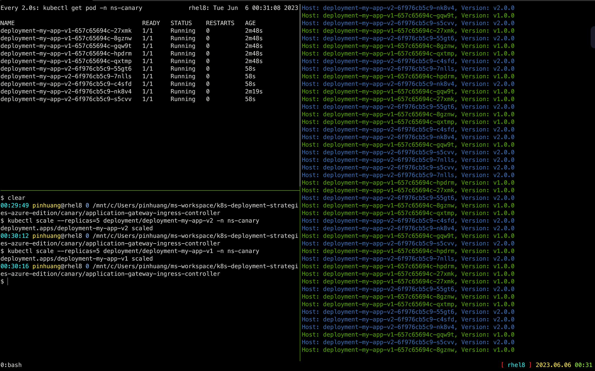

# Canary deployment using Kubernetes native functionnalities and Azure Application Gateway Ingress Controller

> In the following example we apply the `poor man's` canary using Kubernetes
native features (replicas) and Azure Application Gateway Ingress Controller.

If you want a finer grained control over traffic shifting, you can use...

- `nginx-ingress ingress controller` which use [Nginx](http://nginx.org/) to split traffic.
- [`Istio Ingress Gateways`](../istio-service-mesh-addon) which use [Istio](https://istio.io) to split traffic.
- [a/b testing](../../ab-testing) which shift traffic using [Istio](https://istio.io).

## Steps to follow

1. 10 replicas of version 1 is serving traffic
2. deploy 1 replicas version 2 (meaning ~10% of traffic)
3. wait enought time to confirm that version 2 is stable and not throwing unexpected errors
4. scale up version 2 replicas to 10
5. wait until all instances are ready
6. shutdown version 1

## In practice

```bash
# Deploy the first application
$ kubectl apply -f app-v1.yaml
namespace/ns-canary created
deployment.apps/deployment-my-app-v1 created
service/svc-my-app created
ingress.networking.k8s.io/ingress-canary created

# Test if the deployment was successful
$ ./curl.py apgw.aks.aliez.tw
Host: deployment-my-app-v1-657c65694c-vdvd8, Version: v1.0.0
Host: deployment-my-app-v1-657c65694c-8v54k, Version: v1.0.0
Host: deployment-my-app-v1-657c65694c-9hcwk, Version: v1.0.0
...omit...

# To see the deployment in action, open a new terminal and run a watch command.
# It will show you a better view on the progress
$ watch kubectl get pod -n ns-canary
NAME                                    READY   STATUS    RESTARTS   AGE
deployment-my-app-v1-657c65694c-7bhrg   1/1     Running   0          68s
deployment-my-app-v1-657c65694c-8v54k   1/1     Running   0          68s
deployment-my-app-v1-657c65694c-97bh9   1/1     Running   0          68s
deployment-my-app-v1-657c65694c-9hcwk   1/1     Running   0          68s
deployment-my-app-v1-657c65694c-bz7zj   1/1     Running   0          68s
deployment-my-app-v1-657c65694c-h8glv   1/1     Running   0          68s
deployment-my-app-v1-657c65694c-p6vdc   1/1     Running   0          68s
deployment-my-app-v1-657c65694c-pkrc2   1/1     Running   0          68s
deployment-my-app-v1-657c65694c-rsckt   1/1     Running   0          68s
deployment-my-app-v1-657c65694c-vdvd8   1/1     Running   0          68s

# Then deploy version 2 of the application and scale down version 1 to 9 replicas at same time
# version 2 to 1 replicas (meaning ~10% of traffic) + version 1 to 9 replicas (meaning ~90% of traffic)
$ kubectl apply -f app-v2.yaml
deployment.apps/deployment-my-app-v2 created

$ kubectl scale --replicas=9 deployment/deployment-my-app-v1 -n ns-canary
deployment.apps/deployment-my-app-v1 scaled

# Only one pod with the new version should be running.
# You can test if the second deployment was successful
$ ./curl.py apgw.aks.aliez.tw
...omit...
Host: deployment-my-app-v1-657c65694c-vdvd8, Version: v1.0.0
Host: deployment-my-app-v2-6f976cb5c9-h7f47, Version: v2.0.0
Host: deployment-my-app-v1-657c65694c-vdvd8, Version: v1.0.0
Host: deployment-my-app-v1-657c65694c-8v54k, Version: v1.0.0
Host: deployment-my-app-v1-657c65694c-8v54k, Version: v1.0.0
Host: deployment-my-app-v1-657c65694c-9hcwk, Version: v1.0.0
...omit...

# version 2 to 2 replicas (meaning ~20% of traffic) + version 1 to 8 replicas (meaning ~80% of traffic)
$ kubectl scale --replicas=2 deployment/deployment-my-app-v2 -n ns-canary
$ kubectl scale --replicas=8 deployment/deployment-my-app-v1 -n ns-canary

# version 2 to 5 replicas (meaning ~50% of traffic) + version 1 to 5 replicas (meaning ~50% of traffic)
$ kubectl scale --replicas=5 deployment/deployment-my-app-v2 -n ns-canary
$ kubectl scale --replicas=5 deployment/deployment-my-app-v1 -n ns-canary

# If you are happy with it, scale up the version 2 to 10 replicas
# version 2 to 10 replicas (meaning 100% of traffic) + version 1 to 0 replicas (meaning ~0% of traffic)
$ kubectl scale --replicas=10 deployment/deployment-my-app-v2 -n ns-canary
$ kubectl scale --replicas=0 deployment/deployment-my-app-v1 -n ns-canary
```

### Screen Shot



### Cleanup

```bash
$ kubectl delete -f .
```
