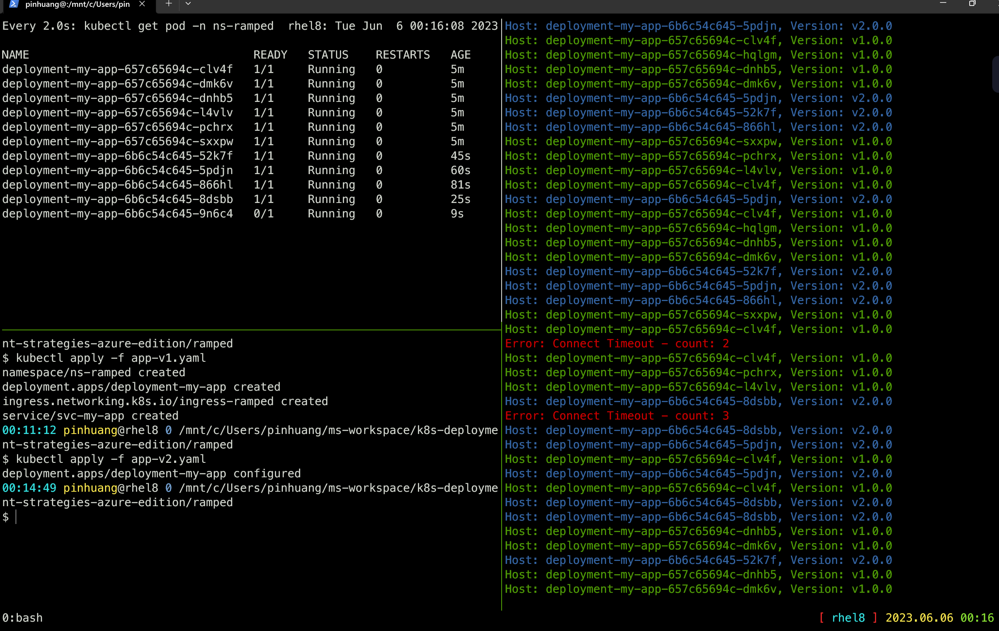

# Ramped deployment

> Version B is slowly rolled out and replacing version A. Also known as
rolling-update or incremental.


The ramped deployment strategy consists of slowly rolling out a version of an
application by replacing instances one after the other until all the instances
are rolled out. It usually follows the following process: with a pool of version
A behind a load balancer, one instance of version B is deployed. When the
service is ready to accept traffic, the instance is added to the pool. Then, one
instance of version A is removed from the pool and shut down.

Depending on the system taking care of the ramped deployment, you can tweak the
following parameters to increase the deployment time:

- Parallelism, max batch size: Number of concurrent instances to roll out.
- Max surge: How many instances to add in addition of the current amount.
- Max unavailable: Number of unavailable instances during the rolling update
  procedure.

## Steps to follow

1. version 1 is serving traffic
1. deploy version 2
1. wait until all replicas are replaced with version 2

## In practice

```bash
# Deploy the first application
$ kubectl apply -f app-v1.yaml
namespace/ns-ramped created
deployment.apps/deployment-my-app created
ingress.networking.k8s.io/ingress-ramped created
service/svc-my-app created

# Test if the deployment was successful
$ ./curl.py apgw.aks.aliez.tw
Host: deployment-my-app-657c65694c-l4vlv, Version: v1.0.0
Host: deployment-my-app-657c65694c-clv4f, Version: v1.0.0
Host: deployment-my-app-657c65694c-dnhb5, Version: v1.0.0
Host: deployment-my-app-657c65694c-dmk6v, Version: v1.0.0
...omitted...

# To see the deployment in action, open a new terminal and run the following
# command
$ watch kubectl get pod -n ns-ramped
NAME                                 READY   STATUS    RESTARTS   AGE
deployment-my-app-657c65694c-clv4f   1/1     Running   0          2m41s
deployment-my-app-657c65694c-dmk6v   1/1     Running   0          2m41s
deployment-my-app-657c65694c-dnhb5   1/1     Running   0          2m41s
deployment-my-app-657c65694c-f8jw4   1/1     Running   0          2m41s
deployment-my-app-657c65694c-hqlgm   1/1     Running   0          2m41s
deployment-my-app-657c65694c-l4vlv   1/1     Running   0          2m41s
deployment-my-app-657c65694c-mf5k4   1/1     Running   0          2m41s
deployment-my-app-657c65694c-pchrx   1/1     Running   0          2m41s
deployment-my-app-657c65694c-rz7x6   1/1     Running   0          2m41s
deployment-my-app-657c65694c-sxxpw   1/1     Running   0          2m41s

# Then deploy version 2 of the application
$ kubectl apply -f app-v2.yaml
deployment.apps/deployment-my-app configured

# Test the second deployment progress
$ ./curl.py apgw.aks.aliez.tw
Host: deployment-my-app-6b6c54c645-866hl, Version: v2.0.0
Host: deployment-my-app-6b6c54c645-dj6xt, Version: v2.0.0
Host: deployment-my-app-657c65694c-l4vlv, Version: v1.0.0
Host: deployment-my-app-6b6c54c645-rfdzc, Version: v2.0.0
Host: deployment-my-app-6b6c54c645-5pdjn, Version: v2.0.0
Host: deployment-my-app-6b6c54c645-8dsbb, Version: v2.0.0
Host: deployment-my-app-6b6c54c645-vjstv, Version: v2.0.0
Host: deployment-my-app-657c65694c-dnhb5, Version: v1.0.0
Host: deployment-my-app-6b6c54c645-9n6c4, Version: v2.0.0
...omit...


# In case you discover some issue with the new version, you can undo the
# rollout
$ kubectl rollout undo deployment/deployment-my-app -n ns-ramped
deployment.apps/deployment-my-app rolled back

# If you can also pause the rollout if you want to run the application for a
# subset of users
$ kubectl rollout pause deployment/deployment-my-app -n ns-ramped
deployment.apps/deployment-my-app paused

# Then if you are satisfied with the result, resume rollout
$ kubectl rollout resume deployment/deployment-my-app -n ns-ramped
deployment.apps/deployment-my-app resumed
```

### Screen Shot



### Cleanup

```bash
$ kubectl delete -f .
namespace "ns-ramped" deleted
deployment.apps "deployment-my-app" deleted
ingress.networking.k8s.io "ingress-ramped" deleted
service "svc-my-app" deleted
Error from server (NotFound): error when deleting "app-v2.yaml": deployments.apps "deployment-my-app" not found
```
