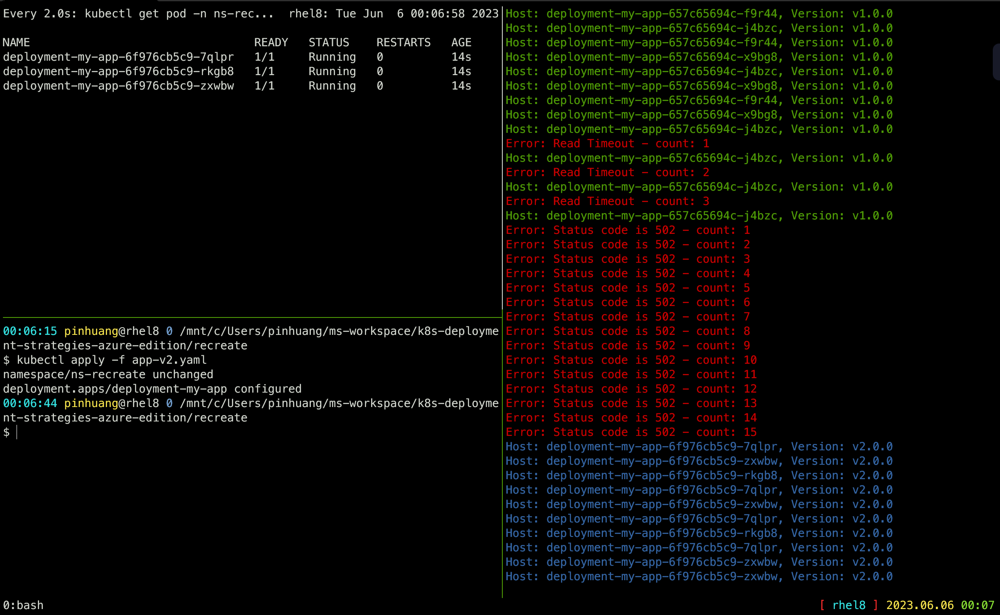

# Recreate deployment

> Version A is terminated then version B is rolled out.


The recreate strategy is a dummy deployment which consists of shutting down
version A then deploying version B after version A is turned off. This technique
implies downtime of the service that depends on both shutdown and boot duration
of the application.

## Steps to follow

1. version 1 is service traffic
2. delete version 1
3. deploy version 2
4. wait until all replicas are ready

## In practice

```bash
# Deploy the first application
$ kubectl apply -f app-v1.yaml
namespace/ns-recreate created
ingress.networking.k8s.io/ingress-recreate created
service/svc-my-app created
deployment.apps/deployment-my-app created

# Test if the deployment was successful
$ ./curl.py apgw.aks.aliez.tw
Host: deployment-my-app-657c65694c-l4vlv, Version: v1.0.0
Host: deployment-my-app-657c65694c-clv4f, Version: v1.0.0
Host: deployment-my-app-657c65694c-dnhb5, Version: v1.0.0
...omit...

# To see the deployment in action, open a new terminal and run the following
# command
$ watch kubectl get pod -n ns-recreate
NAME                                 READY   STATUS    RESTARTS   AGE
deployment-my-app-6888dcf989-d8zsc   1/1     Running   0          94s
deployment-my-app-6888dcf989-m72j5   1/1     Running   0          94s
deployment-my-app-6888dcf989-rtd7x   1/1     Running   0          94s


# Then deploy version 2 of the application
$ kubectl apply -f app-v2.yaml

# Test the second deployment progress
$ ./curl.py apgw.aks.aliez.tw
Host: deployment-my-app-6888dcf989-m72j5, Version: v1.0.0
Host: deployment-my-app-6888dcf989-rtd7x, Version: v1.0.0
Host: deployment-my-app-6888dcf989-d8zsc, Version: v1.0.0
Host: deployment-my-app-6888dcf989-d8zsc, Version: v1.0.0
Host: deployment-my-app-6888dcf989-m72j5, Version: v1.0.0
Host: deployment-my-app-6888dcf989-rtd7x, Version: v1.0.0
...omit...
Host: deployment-my-app-9bbbfc995-bnh6k, Version: v2.0.0
Host: deployment-my-app-9bbbfc995-k8jbp, Version: v2.0.0
Host: deployment-my-app-9bbbfc995-8vksv, Version: v2.0.0
Host: deployment-my-app-9bbbfc995-k8jbp, Version: v2.0.0
Host: deployment-my-app-9bbbfc995-bnh6k, Version: v2.0.0
Host: deployment-my-app-9bbbfc995-8vksv, Version: v2.0.0
```

### Screen Shot



### Cleanup

```bash
$ kubectl delete -f .
namespace "ns-recreate" deleted
deployment.apps "deployment-my-app" deleted
ingress.networking.k8s.io "ingress-recreate" deleted
service "svc-my-app" deleted
namespace "ns-recreate" deleted
Error from server (NotFound): error when deleting "app-v2.yaml": deployments.apps "deployment-my-app" not found
```
